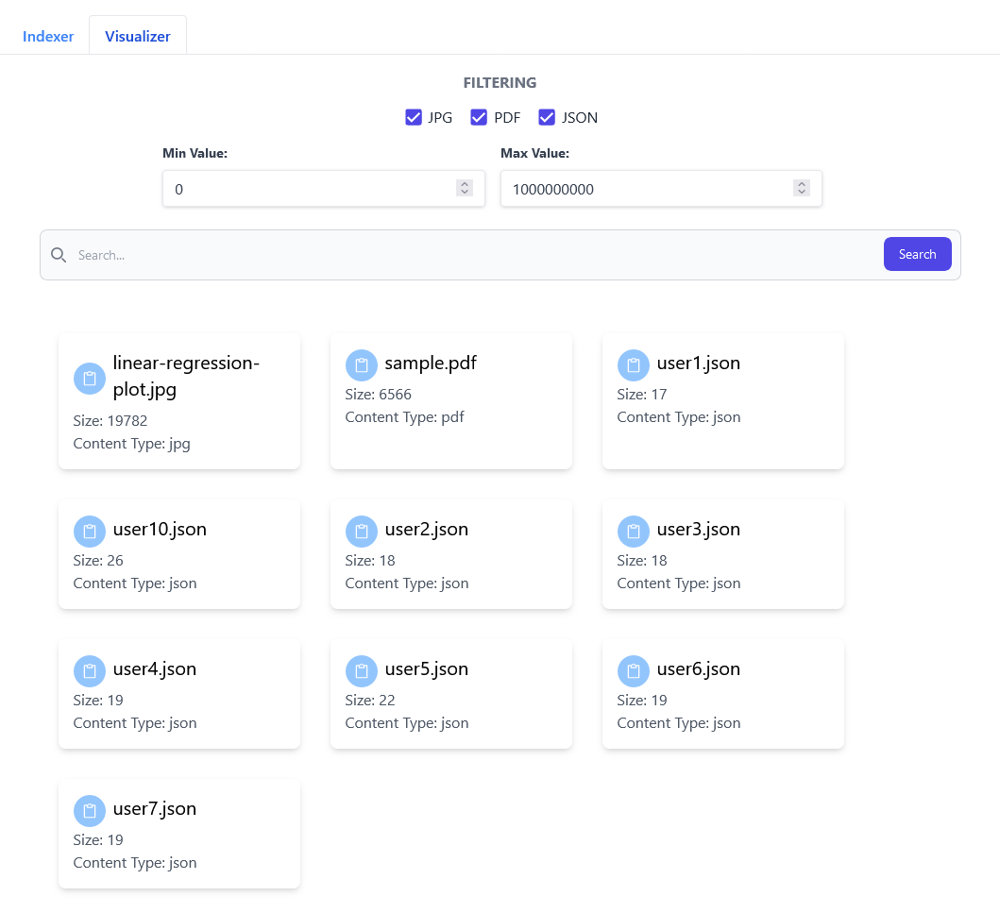

# Take Home Project

A demonstrative web application to build a file index for fast search by name, size, and content type.



## Technologies

- Frontend: React and TailwindCSS
- Backend: Python, Flask and SQLAlchemy
- Database: SQLite

## Requirements

- Docker
- Docker Compose

## Usage

```
docker-compose up
```
